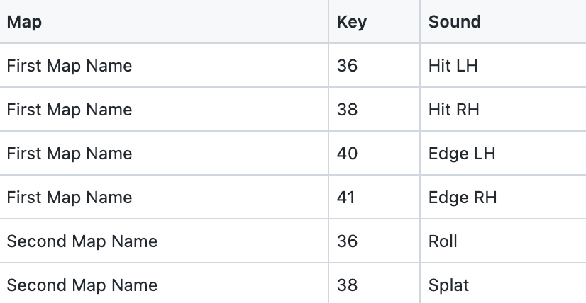

<!--
SPDX-FileCopyrightText: 2022 Barndollar Music, Ltd.

SPDX-License-Identifier: Apache-2.0
-->

# mapdrums
Generate Cubase Drum Map (`.drm`) files from input CSV.

## How to Install

**PREREQUISITE**: requires Python 3.6 or later installed on your system. You can
download the latest verion [here](https://www.python.org/downloads/). See
[Requirements for Installing
Packages](https://packaging.python.org/en/latest/tutorials/installing-packages/#requirements-for-installing-packages)
if you need more help.

Open a terminal program (Terminal, PowerShell, Command Prompt, *etc.*) and
install **mapdrums** with these commands (you may need to restart your terminal
after `ensurepath`):
```bash
python3 -m pip install --user pipx
python3 -m pipx ensurepath
pipx install mapdrums
```

For Windows users, Python 3 might be installed as the `py` program:
```cmd
py -m pip install --user pipx
py -m pipx ensurepath
pipx install mapdrums
```

### Upgrading to a New Version

```bash
pipx upgrade mapdrums
```


## Usage

See [`SampleInput.csv`](samples/SampleInput.csv) for format of the input data
(or [`HwPrcDrumMaps.csv`](samples/HwPrcDrumMaps.csv) for a real example). You
can edit it and save a `.csv` file using Google Sheets or Excel.



Feel free to add additional columns, but this script requires `Map` (drum map
name), `Key` (MIDI key number), and `Sound` (label for the sound that key
makes). As in the samples, you can create multiple drum maps from a single input
`.csv` file.

```bash
mapdrums YourInput.csv
```

This will output one `.drm` file in the current directory for every unique `Map`
value in your input CSV data.

Run `mapdrums -h` to print help for additional options.


## Find a problem?

Look for an existing bug report or file a new issue
[here](https://github.com/barndollarmusic/mapdrums/issues).
