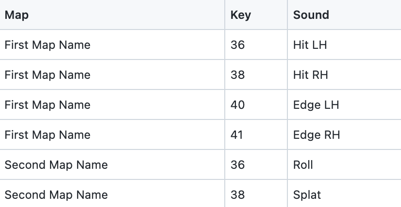

<!--
SPDX-FileCopyrightText: 2022 Barndollar Music, Ltd.

SPDX-License-Identifier: Apache-2.0
-->

# mapdrums
Generate Cubase Drum Map (`.drm`) files from input CSV.

## How to Install

### 1. Install Python

`mapdrums` requires Python 3.

If you don't already have Python installed, download and install it from the [official Python website](https://www.python.org/downloads/).

### 2. Install pipx

Follow the [official pipx installation instructions](https://pipx.pypa.io/latest/how-to/install-pipx.html) for your operating system.

### 3. Install mapdrums

Open a terminal program (Terminal, PowerShell, Command Prompt, etc.) and run:

```console
pipx install mapdrums
```

Once installed, you can run `mapdrums` from any directory.

### Upgrading to a New Version

To upgrade an existing installation of `mapdrums` to the latest version, run:

```console
pipx upgrade mapdrums
```

## Usage

See [`SampleInput.csv`](samples/SampleInput.csv) for format of the input data
(or [`HwPrcDrumMaps.csv`](samples/HwPrcDrumMaps.csv) for a real example). You
can edit it and save a `.csv` file using Google Sheets or Excel.



Feel free to add additional columns, but this script requires `Map` (drum map
name), `Key` (MIDI key number), and `Sound` (label for the sound that key
makes). As in the samples, you can create multiple drum maps from a single input
`.csv` file.

```bash
mapdrums YourInput.csv
```

This will output one `.drm` file in the current directory for every unique `Map`
value in your input CSV data.

Run `mapdrums -h` to print help for additional options.


## Find a problem?

Look for an existing bug report or file a new issue
[here](https://github.com/barndollarmusic/mapdrums/issues).
